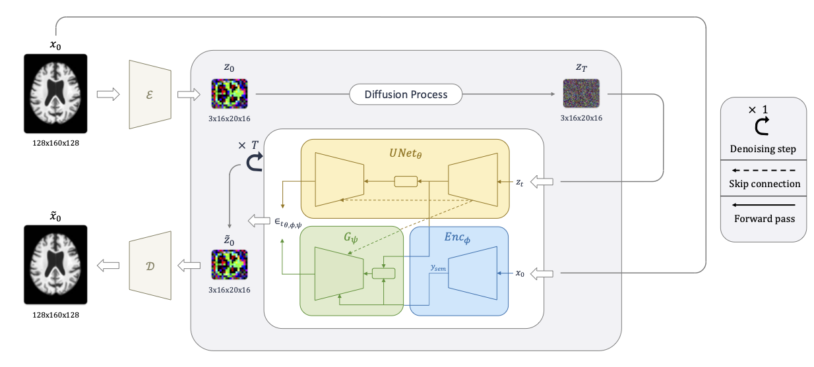
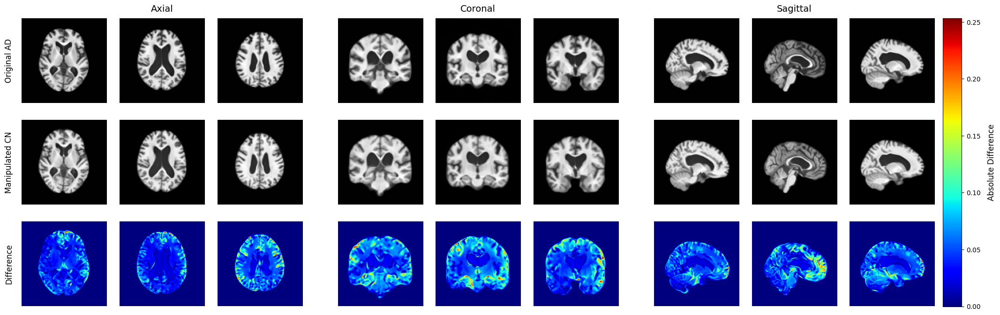
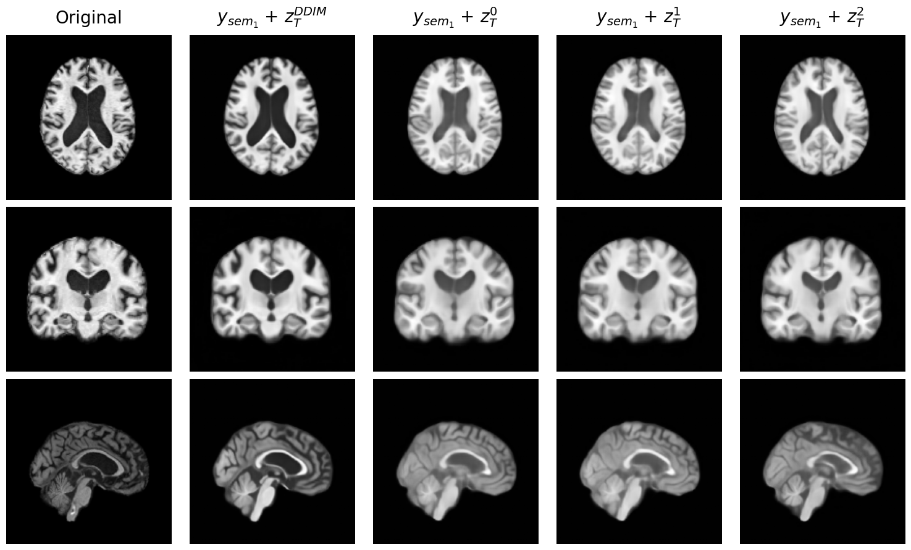
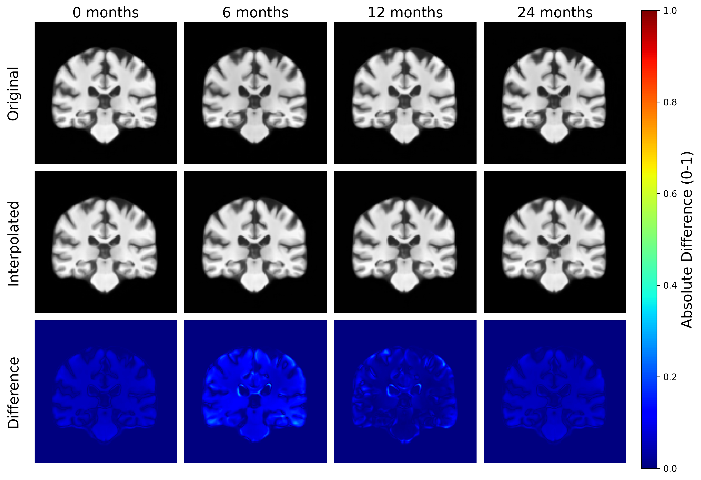

# 🧠 Latent Diffusion Autoencoders (LDAE)


[](https://paperswithcode.com/sota/linear-probe-classification-on-adni?p=latent-diffusion-autoencoders-toward)

Official implementation of the paper: **"[Latent Diffusion Autoencoders: Toward Efficient and Meaningful Unsupervised Representation Learning in Medical Imaging](https://arxiv.org/abs/2504.08635)"**.

<p align="center">
  
</p>

<p align="center">
  <em>A novel unsupervised diffusion-based foundation model for representation learning in 3D medical imaging</em>
</p>

## 📑 Table of Contents
- [Overview](#-overview)
- [Key Features](#-key-features)
- [Model Architecture](#-model-architecture)
- [Framework Capabilities](#-framework-capabilities)
  - [Semantic Manipulation](#-semantic-manipulation)
  - [Stochastic Variation](#-stochastic-variation)
  - [Interpolation](#-interpolation)
- [Installation](#-installation)
- [Data Preparation](#-data-preparation)
- [Usage](#-usage)
- [Results](#-results)
- [Code Structure](#-code-structure)
- [Use Cases](#-use-cases)
- [Citation](#-citation)
- [Acknowledgements](#-acknowledgements)

## 🔍 Overview

Latent Diffusion Autoencoders (LDAE) is a novel unsupervised framework for representation learning in 3D medical imaging. The method compresses 3D MRI scans using an AutoencoderKL, then applies a denoising diffusion process in the compressed latent space, guided by a semantic encoder. The framework is evaluated on Alzheimer's Disease (AD) brain scans from the ADNI dataset.

## 🌟 Key Features

- **First latent diffusion autoencoder framework for 3D medical images** - LDAE learns semantic representations without supervision, suitable for classification, manipulation, and interpolation of brain scans.

- **20x faster inference** than voxel-space DAEs while improving reconstruction fidelity.

- **Semantic control** - Enables manipulation of clinically meaningful features (e.g., Alzheimer's atrophy patterns), smooth interpolation, and scan synthesis from pure noise.

- **Excellent generalizability** - Representations are effective in downstream tasks such as AD classification (ROC-AUC: 89.48%) and age prediction (MAE: 4.16 years).

## 🏗 Model Architecture

LDAE consists of four main components:

1. **AutoencoderKL** - Compresses 3D MRI scans (1×128×160×128) to a low-dimensional latent space (3×16×20×16).

2. **Latent Diffusion Model (LDM)** - A DDPM trained on compressed latents, modeling p(z) with a 3D UNet backbone.

3. **Semantic Encoder (`Encϕ`)** - A 2.5D network that processes slices with a 2D CNN and attention aggregation, producing a semantic vector y_sem ∈ R768.

4. **Gradient Estimator (`Gψ`)** - A conditional decoder approximating ∇z log p(y|z), guiding the reverse diffusion.

The framework operates by first compressing the high-dimensional MRI scans into a more manageable latent space, where the diffusion process can operate efficiently. The semantic encoder extracts meaningful clinical features from the MRI scans, which are then used to guide the generative process. This approach allows for both efficient representation learning and semantic control over the generated outputs.

## 🧠 Framework Capabilities

### 🔄 Semantic Manipulation

After training a linear classifier on the semantic embeddings `y_sem`, the weight vector `w` represents the direction of a clinical trait (e.g., Alzheimer's Disease vs Cognitively Normal).

- Extract the semantic vector from a brain scan using the semantic encoder: `y_sem = Encϕ(x)` and the stochastic latent vector: `z_T = DDIM_encode(z)` in which `z` is the compressed representation of the brain scan generated by the AutoencoderKL.
- Modify a scan's semantics by: `y_manip = y_sem + α * w`
- Decode using `DDIM_sample(y_manip, z_T)` to simulate progression or regression of clinical traits
- Enables fine-grained control over clinically relevant features (e.g., ventricle shrinkage, hippocampal recovery)

This capability can be used for counterfactual explanations, showing how a brain would appear with or without disease-related features:

<p align="center">
  
</p>

### 🎲 Stochastic Variation

With a fixed semantic code `y_sem`, we can sample multiple noise vectors `z_T ~ N(0, I)` to generate variations of a brain scan with a similar semantic content this helps to visualize the semantic space:

```python
x_hat = DDIM_sample(y_sem, z_T)
```

Each sample maintains the same core anatomical structure but varies in low-level details:

<p align="center">
  
</p>

### 🔄 Interpolation

Given two brain scans A and B, LDAE can interpolate between them in both semantic and stochastic spaces:

```python
y_t = (1 - t) * y1 + t * y2  # Linear interpolation (LERP) in semantic space
z_t = SLERP(z1, z2, t)       # Spherical interpolation (SLERP) in latent space
```

These are decoded via `x_hat = DDIM_sample(y_t, z_t)`. This approach is especially useful for simulating disease progression or creating smooth transitions between time points:

<p align="center">
  
</p>

Interpolation enables visualization of brain evolution over time and can help simulate missing timepoints in longitudinal studies.

## 🔧 Installation

### Option 1: Using Docker

```bash
# Build the Docker image
docker build -t ldae .

# Run the container with appropriate volume mounts
docker run -it --gpus all -v /path/to/data:/data -v /path/to/project:/app/LDAE ldae
```

### Option 2: Using Anaconda (Recommended)

```bash
# Create and activate a new conda environment
conda create -n ldae python=3.11
conda activate ldae

# Install dependencies
pip install -r requirements.txt
```

### Pretrained Models

Download the following pretrained models and place them in the `models/` directory to run the tutorial:

- [AutoencoderKL (AEKL)](https://drive.google.com/file/d/1GwavUxV6n_oLGwrUvXAGj6wmemEqMK4D/view?usp=sharing)
- [Semantic Encoder](https://drive.google.com/file/d/1IfFOwtnsYoup3LvVmkkQCvC6cQHBwPMH/view?usp=sharing)
- [Decoder (Generative Model)](https://drive.google.com/file/d/1XzvGnXD9ogK8bvuSrvBSg2PWqXPtU5O2/view?usp=sharing)

## 📊 Data Preparation

For data preparation, please refer to the [AXIAL repository's data preparation section](https://github.com/GabrieleLozupone/AXIAL?tab=readme-ov-file#data-preparation). While the AXIAL project focused on a specific ADNI dataset collection, this project uses the full ADNI dataset of T1-weighted MRI scans. However, the preparation steps remain the same:

1. Download T1-weighted MRI scans from the ADNI database
2. Convert the data to BIDS format using Clinica
3. Preprocess the scans for bias field correction, brain extraction and registration
4. Create a CSV file with paths to preprocessed images and corresponding labels

Note that access to the ADNI dataset requires [proper credentials and approval](http://adni.loni.usc.edu/).

### CSV Format

The datamodule (`brain_mr_dm.py`) expects a CSV file with the following columns:

- `subject`: Subject identifier
- `path`: Path to the preprocessed MRI scan
- `diagnosis`: Diagnosis label (e.g., AD, CN, MCI)
- `session`: Session number
- `latent_path`: Path to the compressed latent representation (generated after training the AutoencoderKL)
- `age`: Subject age at the time of scan

### Generating Compressed Latents

After training the AutoencoderKL (first stage of the pipeline), you need to generate compressed latent representations for all your MRI scans:

```bash
python scripts/save_compressed_latent.py --csv_path /path/to/dataset.csv --ae_model_path /path/to/autoencoderkl.pth
```

This script will:
1. Load the trained AutoencoderKL model
2. Process each MRI scan to generate its compressed latent representation
3. Save the latents as NPZ files
4. Create a new CSV file (`*_with_compressed_latent.csv`) that includes paths to these latent files

Use this updated CSV for subsequent training stages.

## 🚀 Usage

### Complete Tutorial

A comprehensive tutorial is available in `notebooks/tutorial.ipynb`, which demonstrates the full capabilities of LDAE:
- Loading and preprocessing brain MRI scans
- Compressing and reconstructing with AutoencoderKL
- Generating stochastic variations with LDAE
- Reconstructing with LDAE
- Classifying scans and estimating age with the semantic encoder
- Generating intermediate scans through interpolation (LERP in semantic space, SLERP in stochastic space)
- Manipulating brain scans in Alzheimer's Disease (AD) or Cognitively Normal (CN) direction

We recommend following this tutorial to understand the full workflow of LDAE.

### Training Pipeline

1. **Train the AutoencoderKL:**
```bash
python run_cli.py fit --config config/aekl.yaml
```

2. **Pre-train the Latent Diffusion Model:**
```bash
python run_cli.py fit --config config/ldae_pretrain.yaml
```

3. **Train the Representation Learning Component:**
```bash
python run_cli.py fit --config config/ldae_repr_learn.yaml
```

### Downstream Tasks Evaluation

Once you have trained the representation learning component (which includes the semantic encoder trained to fill the posterior mean gap), you can evaluate the learned representations on downstream tasks:

1. **Extract semantic latents for training and testing:**
```bash
python scripts/save_semantic_latent.py --csv_path /path/to/data.csv --model_path /path/to/checkpoint.ckpt --config_path config/ldae_repr_learn.yaml --model_name ldae --target_model ema_encoder --suffix v1
```

2. **Train and evaluate linear probes for downstream tasks:**
```bash
# For Alzheimer's Disease classification (AD vs CN)
python scripts/train_manipulation.py --train_on_age=False --train_data_path /path/to/train_embeddings.pt --test_data_path /path/to/test_embeddings.pt --suffix ldae_ad_vs_cn --target_classes 0 1

# For age prediction
python scripts/train_manipulation.py --train_on_age=True --train_data_path /path/to/train_embeddings.pt --test_data_path /path/to/test_embeddings.pt --suffix ldae_age
```

Note: The classification and regression YAML config files in the `config` folder are for testing the 2.5D attention semantic encoder with supervision on classification and regression tasks.

## 📊 Results

### LDAE Reconstruction Quality

The table below shows reconstruction quality metrics for LDAE at different sampling steps (T):

| LDAE Configuration | T Value | SSIM (↑) | LPIPS (↓) | MSE (↓) |
|-------------------|---------|----------|-----------|---------|
| **LDAE** (Encoded $x_T$) | T=10 | 0.953 | 0.081 | 0.001 |
| **LDAE** (Encoded $x_T$) | T=20 | 0.960 | 0.077 | 0.001 |
| **LDAE** (Encoded $x_T$) | T=50 | 0.962 | 0.076 | 0.001 |
| **LDAE** (Encoded $x_T$) | T=100 | **0.962** | **0.075** | **0.001** |
| **LDAE** (from $y_{sem}$ only) | T=10 | 0.872 | 0.156 | 0.005 |
| **LDAE** (from $y_{sem}$ only) | T=20 | 0.871 | 0.155 | 0.005 |
| **LDAE** (from $y_{sem}$ only) | T=50 | 0.870 | 0.155 | 0.005 |
| **LDAE** (from $y_{sem}$ only) | T=100 | 0.869 | 0.155 | 0.005 |
| **AutoencoderKL** (reference) | - | **0.962** |**0.075** | **0.001** |

Note: LDAE with encoded $x_T$ achieves the same reconstruction quality as the AutoencoderKL bottleneck (0.962 SSIM) with as few as 50 sampling steps, while being 20× faster than voxel-space DAE at inference time.

### Model Comparison

For comparison with other approaches (at T=100):

| Model | Latent dim | SSIM (↑) | LPIPS (↓) | MSE (↓) |
|-------|------------|----------|-----------|---------|
| **LDAE** (Encoded $x_T$) | 5,888 | 0.962 | 0.075 | 0.001 |
| **LDDIM** (Encoded $x_T$) | 5,120 | 0.962 | 0.075 | 0.001 |
| **DAE** (Encoded $x_T$) | 1,605,632 | 0.892 | 0.030 | 0.001 |

### Downstream Task Performance

Linear probes were trained on top of the semantic representations learned by different encoders:
| Model | Accuracy | Precision | Recall | F1-score | ROC-AUC | MAE (↓) | RMSE (↓) |
|-------|----------|-----------|--------|----------|---------|---------|----------|
| **LDAE (Ours)** | 83.65% | 84.69% | **91.02%** | **87.74%** | 89.48% | **4.16** | 5.23 |
| **DAE (Baseline)** | 74.68% | 77.68% | 85.04% | 81.19% | 78.00% | 4.93 | 6.11 |
| **Supervised Encoder** | **84.64%** | **86.90%** | 87.43% | 87.16% | **90.67%** | 4.34 | **4.63** |

These results demonstrate that unsupervised LDAE representations are highly effective for both classification (AD vs CN) and regression (age prediction) tasks, approaching the performance of supervised learning while significantly outperforming the baseline DAE approach.

### Interpolation Quality

LDAE maintains high reconstruction quality (SSIM > 0.93) when interpolating between brain scans with a 24-month gap, enabling smooth visualization of disease progression or brain changes over time.

## 📘 Code Structure

```
├── Dockerfile                          # Containerized environment
├── requirements.txt                    # Dependencies
├── run_cli.py                          # Entrypoint for training/evaluation
├── config/                             # YAML configs for all stages
├── models/                             # Pretrained model's folder
├── notebooks/tutorial.ipynb            # Interactive tutorial
├── scripts/                            # Utility scripts
├── src/
│   ├── data/                           # ADNI datamodule and transforms
│   ├── ldae/
│   │   ├── ae_kl.py                    # AutoencoderKL
│   │   ├── diffusion/                  # DDPM, DDIM, encoding, generation, ...
│   │   ├── enc_classification.py       # Supervised encoder classification
│   │   ├── enc_regression.py           # Supervised encoder regression
│   │   ├── ldae.py                     # Main LDAE pipeline
│   │   ├── modules/                    # Attention, positional encoding, ...
│   │   ├── nets/                       # UNet, semantic encoder, gradient estimator, ...
│   │   └── utils/                      # Training and net utilities
│   └── utils/                          # Miscellaneous tools
```

## 📌 Use Cases

- **Foundation model pretraining** in medical imaging
- **Semantic editing** (e.g., counterfactual explanations, missing point interpolation)
- **Data augmentation** via controlled feature disentanglement
- **Age or disease classification** from unsupervised codes

## 📢 Citation

If you use this work, please cite:
```bibtex
@misc{lozupone2025latentdiffusionautoencodersefficient,
      title={Latent Diffusion Autoencoders: Toward Efficient and Meaningful Unsupervised Representation Learning in Medical Imaging}, 
      author={Gabriele Lozupone and Alessandro Bria and Francesco Fontanella and Frederick J. A. Meijer and Claudio De Stefano and Henkjan Huisman},
      year={2025},
      eprint={2504.08635},
      archivePrefix={arXiv},
      primaryClass={cs.CV},
      url={https://arxiv.org/abs/2504.08635}, 
}
```

If you find our work useful or use our code, please also consider citing our related work:

```bibtex
@article{lozupone2024axial,
  title={AXIAL: Attention-based eXplainability for Interpretable Alzheimer's Localized Diagnosis using 2D CNNs on 3D MRI brain scans},
  author={Lozupone, Gabriele and Bria, Alessandro and Fontanella, Francesco and Meijer, Frederick JA and De Stefano, Claudio},
  journal={arXiv preprint arXiv:2407.02418},
  year={2024}
}
```

## 🙌 Acknowledgements

This work was supported by the Rome Technopole project and used data from the Alzheimer's Disease Neuroimaging Initiative (ADNI).

We would like to thank the authors of the following works which inspired our research:

* **PDAE (Pre-trained Diffusion Autoencoders)**:
  * Code: [GitHub Repository](https://github.com/ckczzj/PDAE)
  * Paper: [Unsupervised Representation Learning from Pre-trained Diffusion Probabilistic Models](https://arxiv.org/abs/2212.12990)

* **Brain Imaging Generation with Latent Diffusion Models**:
  * Code: [MONAI GenerativeModels](https://github.com/Project-MONAI/GenerativeModels/tree/main/model-zoo/models/brain_image_synthesis_latent_diffusion_model)
  * Paper: [Brain Imaging Generation with Latent Diffusion Models](https://arxiv.org/abs/2209.07162)
